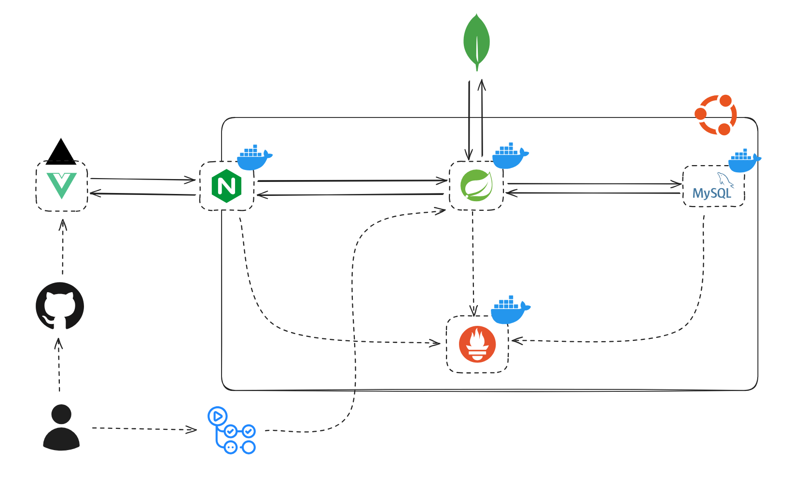

# 온프레미스 서버 기반 블로그 프로젝트

- 개인 서버 환경에서 Spring Boot와 Java 기반으로 개발한 블로그 웹 서비스 개인 프로젝트
- 게시글, 댓글, 회원 인증을 비롯해 이미지 업로드, 검색 및 데이터 동기화 등 백엔드 전반의 기능을 설계하고 구현
- 인증 보안, 성능 최적화, 검색 품질, 테스트 및 배포 자동화, 유지보수성을 고려하여 개발

### ✅ 기술 스택

**Backend**
- Java 17, Spring Boot 3.4.4, Spring Security, JJWT, Spring Data JPA, QueryDSL

**Database / Search**
- MySQL, MongoDB Atlas Search

**Infra / CI·CD**
- Docker, Docker Compose, GitHub Actions

**External Service**
- Cloudinary

**Test / Documentation**
- JUnit 5, Mockito, H2, Embedded Mongo, Spring Rest Docs, Asciidoctor

### ✅ Architecture

### ✅ 배포 환경

- [온프레미스 서버 스펙](https://github.com/heojinn/spring-blog-backend/wiki/2.-On%E2%80%90Premises-Server-Specifications)

### ✅ 주요 기능

▶ 게시글

1. 게시글 작성 / 수정 / 삭제 / 조회
2. 카테고리 및 태그 기반 게시글 분류
3. 마크다운 본문 처리
4. 검색 인덱싱을 위한 Plain Text 변환

▶ [더보기](https://github.com/heojinn/spring-blog-backend/wiki/3.-Business-Rule)

### ✅ 주요 기술 구현 정리

#### [CI/CD Pipeline](https://github.com/heojinn/spring-blog-backend/wiki/4.-CI-CD-Pipeline)

#### [Docker & Docker Compose](https://github.com/heojinn/spring-blog-backend/wiki/5.-Docker-&-Docker-Compose-Configuration)

#### [Authentication & Authorization](https://github.com/heojinn/spring-blog-backend/wiki/6.-Authentication-&-Authorization)

#### [이미지 최적화](https://github.com/heojinn/spring-blog-backend/wiki/7.-Image-Optimization)

#### [Search Engine Optimization](https://github.com/heojinn/spring-blog-backend/wiki/8.-Search-Engine-Optimization)

#### [Test Strategy](https://github.com/heojinn/spring-blog-backend/wiki/9.-Test-Strategy)

