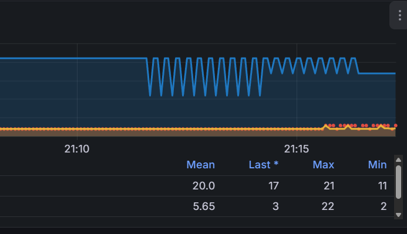
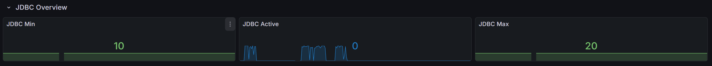

# 부하 테스트 + 최적화 관련

## 부하테스트 전체 구조 


## 부하 테스트 환경 설정 관련

- 커널 수준 리소스 제한 활용 (docker cgroup)


### cgroup 설정 관련

> **설정 근거**
> - **CPU 1.25 Core**: Spring Boot 애플리케이션이 GC(Garbage Collection)와 비즈니스 로직을 처리하기 위한 최소한의 병렬 처리 성능 확보.
> - **Memory 2GB**: JVM Heap(약 1GB~1.5GB 예상)과 Metaspace, Native Memory(Thread Stack 등)를 고려한 안정권 설정.
> - **Proxy & Monitoring**: 모니터링 도구가 테스트 대상(SUT)의 자원을 뺏지 않도록 낮은 우선순위와 적은 리소스를 할당.

| **컨테이너**        | **역할**    | **CPU Limit (상한)** | **Memory Limit (상한)** | **비고**             |
|---------------------| ----------- | ------- | ------------ | -------------------- |
| **blog-loadtest**   | Java 앱     | 1.25    | 2GB          | 메인 테스트 대상     |
| **mysql-container** | DB          | 1.25    | 2GB          | 쿼리 및 I/O 처리     |
| **prometheus**      | 지표 수집   | 1.0     | 1.5GB        | 수집 누락 방지       |
| **grafana**         | 시각화      | 0.5     | 1GB          | 원활한 그래프 렌더링 |
| **my_nginx_server** | 프록시      | 0.4     | 512MB        | 트래픽 중계          |
| **exporter 계열**     | 메트릭 노출 | 0.2     | 128MB        | 지표 데이터 제공     |

#### 제한 확인 체크


## 더미 데이터 관련

### 더미 데이터 주입 시 사용한 Spring batch 코드

[Spring Batch git hub 코드 링크](https://github.com/Kimheojin/spring-batch-preprocessing?tab=readme-ov-file#2-dummydatajob-%EB%B6%80%ED%95%98-%ED%85%8C%EC%8A%A4%ED%8A%B8-%EB%8C%80%EB%B9%84-%EB%8D%B0%EC%9D%B4%ED%84%B0-%EC%A0%81%EC%9E%AC)

### 더미데이터 주요 테이블 row 갯수 

| post_cnt | post_tag_cnt | tag_cnt | category_cnt |
| :--- | :--- | :--- | :--- |
| 3376000 | 5064604 | 50 | 100 |


## 부하 테스트 및 주요 수정 사항

- nginx keep alive (nginx - Spring)을 통한 서버 부하 감소
- 서버 spec 대비 과도한 데이터 부하 환경으로 인한 반 정규화를 통한 최적화
- connection 갯수 조정

### nginx keep alive 설정 적용 (nginx - spring)

#### 문제 상황

- K6 에서 100 ops 정도의 낮은 부하시 에도 Tomcat 의 쓰레드 수가 과하게 활성화
- 기존 nginx - Spring 간 Connection 미 재사용으로 인해 발생 추정


##### 최적화 전 nginx 설정

```
server {
    listen 443 ssl;
    server_name heojineee.ddnsking.com;

    location /api {
        # 백엔드 서버로 직접 연결
        proxy_pass http://blog-loadtest:9003;
        
        proxy_set_header Host $host;
        proxy_set_header X-Real-IP $remote_addr;
        proxy_set_header X-Forwarded-For $proxy_add_x_forwarded_for;
        proxy_set_header X-Forwarded-Proto $scheme;
    }
}

```

#### 최적화 후 nginx 설정

> **Keep-alive 최적화의 기술적 배경**
> - **TCP Handshake 비용 절감**: HTTP/1.0 또는 비활성화된 Keep-alive 환경에서는 매 요청마다 `3-way Handshake`와 `4-way Handshake(종료)`가 발생합니다. 이는 네트워크 레이턴시를 증가시키고 OS의 포트 고갈(Ephemeral Port Exhaustion)을 유발할 수 있습니다.
> - **Upstream Keepalive**: Nginx와 WAS(Spring Boot) 사이에 영구적인 연결(Persistent Connection)을 맺어두어, 요청이 들어올 때마다 소켓을 새로 열지 않고 미리 열려있는 소켓을 재사용합니다.

```
# 백엔드 연결 풀 설정
upstream blog_backend {
    server blog-loadtest:9003;
    keepalive 32; # 유지할 idle 커넥션 수
    # 주의: keepalive 수는 예상되는 동시 접속 트래픽과 WAS의 Thread Pool 사이즈를 고려하여 설정해야 합니다.
}

server {
    listen 443 ssl;
    server_name heojineee.ddnsking.com;

    location /api {
        proxy_pass http://blog_backend;
        
        # Keep-alive 활성화를 위한 필수 설정
        proxy_http_version 1.1; # HTTP/1.0은 Keep-alive를 지원하지 않으므로 1.1 강제
        proxy_set_header Connection ""; # Client가 보낸 'close' 헤더를 무시하고 Upstream과 연결 유지
        
        proxy_set_header Host $host;
        proxy_set_header X-Real-IP $remote_addr;
        proxy_set_header X-Forwarded-For $proxy_add_x_forwarded_for;
        proxy_set_header X-Forwarded-Proto $scheme;
    }
}
```

#### 주요 변경사항 상세 분석

- **upstream & keepalive**
  - 단순한 연결 유지가 아니라, **Upstream 서버(Spring)로 보내는 연결을 캐싱**하는 역할을 합니다.
  - 설정된 숫자(32)는 각 Nginx Worker Process가 캐시에 유지할 수 있는 **유휴(Idle) Keep-alive 커넥션의 최대 개수**입니다.

- **proxy_http_version 1.1**
  - HTTP/1.1 스펙부터 기본적으로 Connection이 유지됩니다. 이를 명시하지 않으면 Nginx는 기본적으로 Upstream에 HTTP/1.0으로 요청을 보내며 연결을 즉시 끊습니다.

- **proxy_set_header Connection ""**
  - 클라이언트가 `Connection: close` 헤더를 보내더라도, Nginx가 이를 지우고 백엔드에는 열린 연결을 유지하도록 강제합니다. 이 설정이 없으면 백엔드(Spring)는 요청 처리 후 소켓을 닫아버릴 수 있습니다.

#### 성능 개선 결과


- Tomcat Thread 관리 효율화
  - Current Threads 수치가 최대치(60)에서 안정 수치 (22 ~ 25) 로 약 60% 감소
  
- 동일한 초당 부하량 (100ops) 을 유지하면서도 서버 자원 가용상 향상 기대

### 반 정규화를 통한 쿼리 최적화

#### 문제 상황

- K6를 통한 부하 환경에서 카테고리별 게시글 수 조회 시 337만 건의 데이터를 실시간 집계함에 따라 
  - CPU 점유율 128% 초과 및 메모리 94% 점유 발생. 초당 100회 요청(100 OPS) 처리 불가.
  - 또한 과도한 쓰레드 점유 상황 발생 

.png)

.png)


#### 원인 상세 분석

1.  **Full Scan / Index Scan 비용 과다**: `SELECT COUNT(*) FROM post WHERE category_id = ?` 쿼리는 인덱스가 있더라도, 조건에 맞는 **모든 레코드**를 스캔하여 개수를 세어야 합니다. 데이터가 300만 건 이상일 때 이는 막대한 CPU 연산과 Disk I/O를 유발합니다.
2.  **Thread Blocking**: DB가 연산을 수행하는 동안 Spring의 워커 스레드는 응답을 받지 못하고 대기(Waiting) 상태에 빠집니다. 이는 스레드 풀 고갈로 이어져, 가벼운 다른 요청들까지 처리하지 못하는 연쇄 장애(Cascading Failure)를 일으킵니다.

#### 반 정규화(De-normalization) 최적화 전략

"조회 성능을 위해 쓰기 성능과 데이터 정합성 관리 비용을 지불한다."

- **전략**: `Category` 테이블에 `post_count` 컬럼을 추가하여, 미리 계산된 값을 저장해두고 읽기 시에는 단순 조회(O(1))만 수행합니다.
- **Trade-off (고려사항)**:
    - **장점**: 조회 속도가 데이터 양과 무관하게 일정해짐. CPU 부하 거의 없음.
    - **단점**: 게시글 작성/삭제 시마다 `category` 테이블도 함께 수정(`UPDATE`)해야 하므로 쓰기 트랜잭션 비용이 증가함. 또한 동시성 이슈로 숫자가 틀어질 가능성이 있어 주기적인 배치(Batch) 작업으로 `Sync`를 맞춰주어야 함.

#### 적용 쿼리 및 로직

```aiexclude
-- 1. Category 엔티티에 컬럼 추가
ALTER TABLE category ADD COLUMN post_count INT DEFAULT 0;

-- 2. 기존 데이터 업데이트 (1회성)
UPDATE category c SET c.post_count = (
    SELECT COUNT(*) FROM post p 
    WHERE p.category_id = c.category_id AND p.status = 'PUBLISHED'
);

-- 3. 조회 쿼리
SELECT category_id, category_name, post_count, priority 
FROM category 
ORDER BY priority ASC, category_name ASC;
```


#### 최적화 결과 확인

- **CPU 및 메모리 안정화 (위 이미지)**
  - 반정규화 적용 후 JOIN 연산 제거로 인해 CPU 점유율이 안정권으로 하락
  - 메모리 사용 효율 개선



- **TPS 처리량 향상 (위 이미지)**
  - 쿼리 비용 감소로 인해 초당 처리 가능한 요청 수(TPS)가 목표치에 근접하게 상승

---

### connection 수 개선

#### 문제 상황


- **현상**: 500 ops 부하 테스트 시 목표 처리량을 달성하지 못함
- **원인**: `HikariCP Pending Connections` 지표가 급증하는 것으로 보아, DB 커넥션 풀 고갈로 인한 병목 현상 확인

#### 해결 방안 및 결과

### 적용 후



- **조치**: 서버 리소스(1.25 vCPU)를 고려하여 `maximum-pool-size`를 20으로 상향 조정 (기본값 10 -> 20)
- **이론적 배경 (Pool Size 산정)**:
    - HikariCP 공식 문서 및 PostgreSQL 등의 권장 공식: `connections = ((core_count * 2) + effective_spindle_count)`
    - **Why not 100?**: 커넥션 수가 코어 수에 비해 과도하게 많으면, OS 스케줄러가 스레드 간 컨텍스트 스위칭(Context Switching)을 하느라 실제 쿼리 처리보다 오버헤드에 더 많은 CPU를 소모하게 됩니다. 
    - 본 환경(1.25 Core)에서는 `10`은 트래픽 대비 다소 부족하여 대기열(Pending)이 발생했고, `20`으로 늘려 대기 시간을 해소하면서도 컨텍스트 스위칭 부하를 억제하는 적정 지점을 찾았습니다.
- **결과**: Pending 상태 없이 안정적인 커넥션 획득 및 처리량 확보

```yaml
  # DB 커넥션 풀 수치 조정 (1.25 Core 환경)
  datasource:
    hikari:
      maximum-pool-size: 20 # 20으로 조정: 동시 트래픽 수용량 증대
      minimum-idle: 10 # 최소 유휴 커넥션 확보
      connection-timeout: 5000 # 5초 내 연결 실패 시 에러 (빠른 실패 전략)
      pool-name: HikariCP-Performance
```


## k6 부하 테스트 지표 비교 (stats_denormalized_500.js)

> **주요 지표 설명**
> - **TPS (Transactions Per Second)**: 초당 처리된 트랜잭션 수. 시스템의 실제 처리 용량(Throughput)을 의미합니다.
> - **p(95) 응답 시간**: 전체 요청 중 95%가 이 시간 이내에 완료됨을 의미합니다. 평균값보다 꼬리 지연(Tail Latency)을 파악하는 데 훨씬 중요합니다.
> - **Dropped Iterations**: 부하 생성기(Client)가 목표 부하를 맞추려 했으나, 서버가 응답하지 않아 생성을 포기한 요청 수입니다. **0이 아니면 시스템이 감당 불가능한 상태**임을 뜻합니다.

| 지표 항목 | 이전 테스트 (실패) | 현재 테스트 (개선) | 비고 |
| :--- | :--- | :--- | :--- |
| **Target TPS** | 500 iters/s | 500 iters/s | 동일 설정 |
| **Actual TPS** | 449.44 iters/s | 469.43 iters/s | 처리량 약 4.4% 향상 |
| **p(95) 응답 시간** | 1.14s | 87.66ms | 약 13배 개선 (성능 핵심) |
| **Max 응답 시간** | 26.51s | 2.13s | 지연 시간 대폭 감소 |
| **Dropped Iterations** | 5250건 | 146건 | 누락 요청 급감 |
| **Max 사용 VU** | 300 (제한 도달) | 164 | 리소스 사용 효율 증가 |
| **Thresholds 결과** | ✗ 실패 | ✓ 성공 | 모든 기준 충족 |


## 기술적 의사결정 및 한계 (Q&A)

**Q. 조회수 성능 개선에 왜 Redis 캐싱 대신 반정규화를 선택했나요?**
- **인프라 복잡도 최소화**: 제한된 리소스(1.25 Core) 환경에서 Redis 컨테이너를 추가하는 오버헤드보다, RDB 내부 스키마 최적화가 비용 효율적이라 판단했습니다.
- **관리 포인트 집중**: 데이터 정합성 관리 포인트를 DB 하나로 유지하여 운영 복잡도를 낮췄습니다. (추후 트래픽이 더 증가하면 Redis 도입 예정)

**Q. 반정규화 데이터의 정합성(동시성) 문제는 어떻게 해결하나요?**
- **한계점**: 동시에 여러 트랜잭션이 발생할 경우 `post_count` 숫자가 실제와 달라질 수 있습니다.
- **보완책**: 실시간으로 완벽한 숫자가 중요하지 않은 로직이므로, 주기적인 **Spring Batch (새벽 시간대)** 작업을 통해 `Count(*)` 값으로 보정하여 오차를 맞추는 방식을 구상하고 있습니다.

---
## 기타 링크

- [온프레미스 서버 스펙 정리](server-specifications.md)
- [README 이동](../README.md) 
