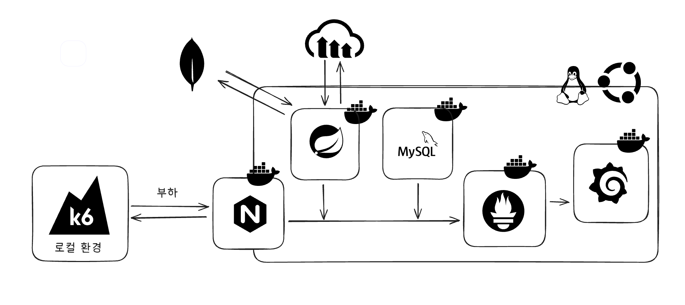
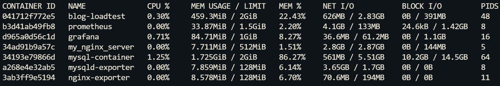
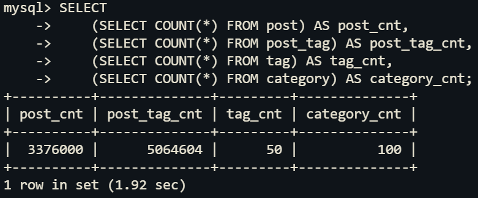
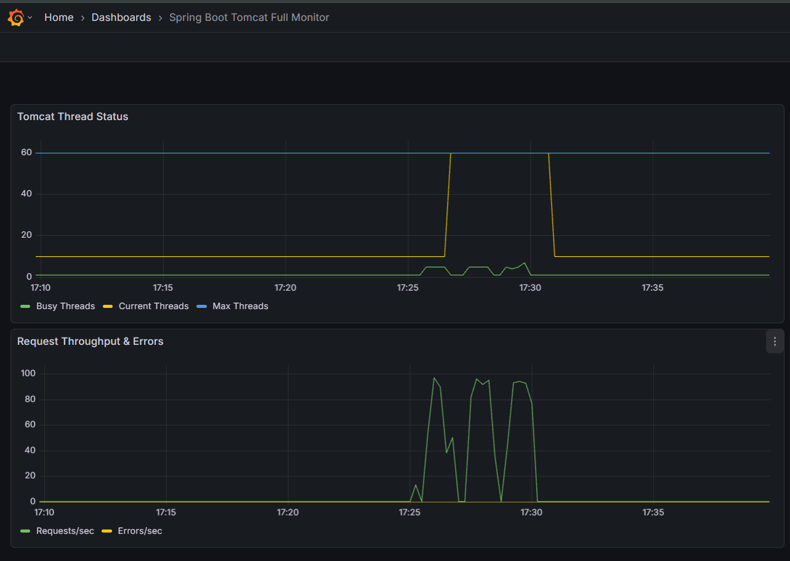
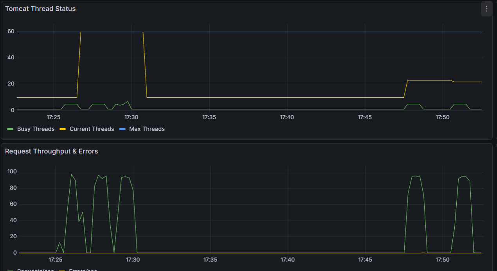
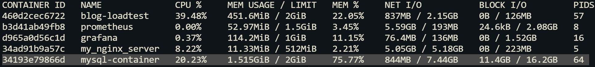
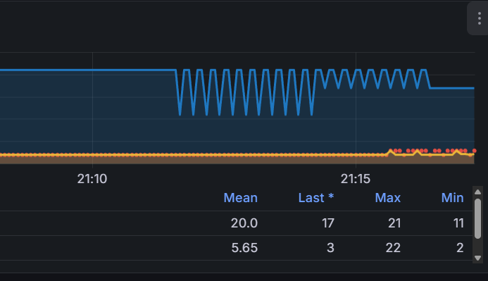

# 부하 테스트 + 최적화 관련

## 부하테스트 전체 구조 



## 부하 테스트 환경 설정 관련

커널 수준 리소스 제한 활용 (docker cgroup)
  
### cgroup 설정 관련

| **컨테이너**        | **역할**    | **CPU Limit (상한)** | **Memory Limit (상한)** | **비고**             |
| ------------------- | ----------- | ------- | ------------ | -------------------- |
| **blog-loadtest**   | Java 앱     | 1.25    | 2GB          | 메인 테스트 대상     |
| **mysql-container** | DB          | 1.25    | 2GB          | 쿼리 및 I/O 처리     |
| **prometheus**      | 지표 수집   | 1.0     | 1.5GB        | 수집 누락 방지       |
| **grafana**         | 시각화      | 0.5     | 1GB          | 원활한 그래프 렌더링 |
| **my_nginx_server** | 프록시      | 0.4     | 512MB        | 트래픽 중계          |
| **exporter 계열**   | 메트릭 노출 | 0.2     | 128MB        | 지표 데이터 제공     |

#### 제한 확인 체크




## 더미 데이터 관련

### 더미 데이터 주입 시 사용한 Spring batch 코드

[Spring Batch git hub 코드 링크](https://github.com/Kimheojin/spring-batch-preprocessing?tab=readme-ov-file#2-dummydatajob-%EB%B6%80%ED%95%98-%ED%85%8C%EC%8A%A4%ED%8A%B8-%EB%8C%80%EB%B9%84-%EB%8D%B0%EC%9D%B4%ED%84%B0-%EC%A0%81%EC%9E%AC)

### 더미데이터 주요 테이블 row 갯수 

| post_cnt | post_tag_cnt | tag_cnt | category_cnt |
| :--- | :--- | :--- | :--- |
| 3376000 | 5064604 | 50 | 100 |



## 부하 테스트 및 주요 수정 사항

- nginx keep alive (nginx - Srping)을 통한 서버 부하 감소
- 서버 spec 대비 과도한 데이터 부하 환경으로 인한 반 정규화를 통한 최적화
- connection 갯수 조정

### nginx keep alive 설정 적용 (nginx - spring)

#### 문제 상황

- K6 에서 100 ops 정도의 낮은 부하시 에도 Tomcat 의 쓰레드 수가 과하게 활성화
- 기존 nginx - Spring 간 Connection 미 재사용으로 인해 발생 추정



##### 최적화 전 nginx 설정

```
server {
    listen 443 ssl;
    server_name heojineee.ddnsking.com;

    location /api {
        # 백엔드 서버로 직접 연결
        proxy_pass http://blog-loadtest:9003;
        
        proxy_set_header Host $host;
        proxy_set_header X-Real-IP $remote_addr;
        proxy_set_header X-Forwarded-For $proxy_add_x_forwarded_for;
        proxy_set_header X-Forwarded-Proto $scheme;
    }
}

```

#### 최적화 후 nginx 설정

```
# 백엔드 연결 풀 설정
upstream blog_backend {
    server blog-loadtest:9003;
    keepalive 32; # 유지할 idle 커넥션 수
}

server {
    listen 443 ssl;
    server_name heojineee.ddnsking.com;

    location /api {
        proxy_pass http://blog_backend;
        
        # Keep-alive 활성화를 위한 필수 설정
        proxy_http_version 1.1; # HTTP/1.1 사용
        proxy_set_header Connection ""; # Connection 헤더 초기화
        
        proxy_set_header Host $host;
        proxy_set_header X-Real-IP $remote_addr;
        proxy_set_header X-Forwarded-For $proxy_add_x_forwarded_for;
        proxy_set_header X-Forwarded-Proto $scheme;
    }
}
```

#### 주요 변경사항 정리

- upstream & keepalive
  - 각 워커 프로세스가 백엔드와 미리 맺어놓을 최대 유휴 연결 수를 정의

- proxy_http_version 1.1
  - HTTP/1.0은 기본적으로 요청마다 연결을 끊으므로, 지속 연결을 위해 1.1을 사용

- proxy_set_header Connection ""
  - 클라이언트의 Connection 헤더가 백엔드로 전달되지 않게 하여 연결 유지를 보장

#### 성능 개선 결과



- Tomcat Thread 관리 효율화
  - Current Threads 수치가 최대치(60)에서 안정 수치 (22 ~ 25) 로 약 60% 감소
  
- 동일한 초당 부하량 (100ops) 을 유지하면서도 서버 자원 가용상 향상 기대

### 반 정규화를 통한 쿼리 최적화

#### 문제 상황

- K6를 통한 부하 환경에서 카테고리별 게시글 수 조회 시 337만 건의 데이터를 실시간 집계함에 따라 
  - CPU 점유율 128% 초과 및 메모리 94% 점유 발생. 초당 100회 요청(100 OPS) 처리 불가.
  - 또한 과도한 쓰레드 점유 상황 발생 

.png)

.png)


#### 원인 분석

- 높은 CPU 사용량과 높은 Block I/O는 정규화된 여러 테이블을 JOIN 하여 조회하는 과정에서 발생하는 비용일 가능성이 농후
- 연결된 대부분의 쓰레드가 대기상태 없이 계속 '실행 중' 상태
  - 쿼리 하나당 스레드가 시간이 길어져(병목 현상 발생) 반환되지 못한다고 판단

#### 반 정규화 최적화 진행

- mysql 컨테이너에 변경사항 적용 후 spring 로직 변경

```aiexclude
-- 1. Category 엔티티에 컬럼 추가
ALTER TABLE category ADD COLUMN post_count INT DEFAULT 0;

-- 2. 기존 데이터 업데이트 (1회성)
UPDATE category c SET c.post_count = (
    SELECT COUNT(*) FROM post p 
    WHERE p.category_id = c.category_id AND p.status = 'PUBLISHED'
);

-- 3. 조회 쿼리
SELECT category_id, category_name, post_count, priority 
FROM category 
ORDER BY priority ASC, category_name ASC;
```


#### 개선 후






---

### connection 수 개선

#### 문제 상황


500 ops 부하시 복표 기준량 못채움, pending 지표가 튀는 것을 확인


## k6 부하 테스트 지표 비교 (stats_denormalized_500.js)

| 지표 항목 | 이전 테스트 (실패) | 현재 테스트 (개선) | 비고 |
| :--- | :--- | :--- | :--- |
| **Target TPS** | 500 iters/s | 500 iters/s | 동일 설정 |
| **Actual TPS** | 449.44 iters/s | 469.43 iters/s | 처리량 약 4.4% 향상 |
| **p(95) 응답 시간** | 1.14s | 87.66ms | 약 13배 개선 (성능 핵심) |
| **Max 응답 시간** | 26.51s | 2.13s | 지연 시간 대폭 감소 |
| **Dropped Iterations** | 5250건 | 146건 | 누락 요청 급감 |
| **Max 사용 VU** | 300 (제한 도달) | 164 | 리소스 사용 효율 증가 |
| **Thresholds 결과** | ✗ 실패 | ✓ 성공 | 모든 기준 충족 |

### 분석 결과
* **병목 현상 해소**: 이전 테스트에서 발생한 VU 부족 경고(Insufficient VUs)가 사라졌으며, 서버가 요청을 밀리지 않고 제때 처리하고 있음.
* **응답 안정성**: p(95) 지표가 100ms 미만으로 내려오며 사용자 경험 측면에서 매우 안정적인 수치를 기록함.
* **잔여 과제**: 여전히 존재하는 2.13s의 최대 지연 시간과 146건의 드랍된 요청은 시스템이 500 TPS를 완벽히 소화하기 위한 마지막 임계점임을 시사함.

### tomcat thread 수치 조정 관련

spring jvm 단에서 과도한 timed-waiting 으로 인한 병목 현상발견

- 적절한 수준의 tomcat 쓰레드 갯수 할당


---
## 기타 링크

- [온프레미스 서버 스펙 정리](server-spec.md)
- [README 이동](../README.md) 
